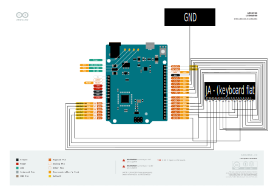
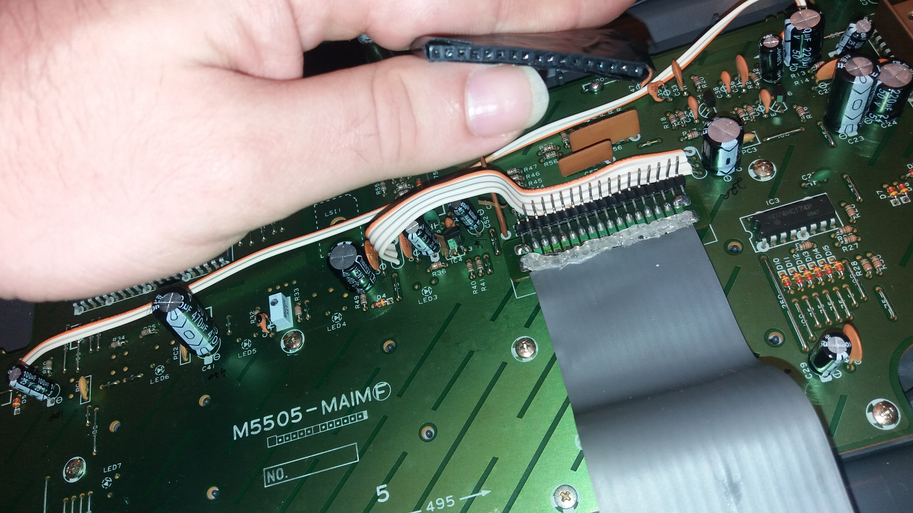
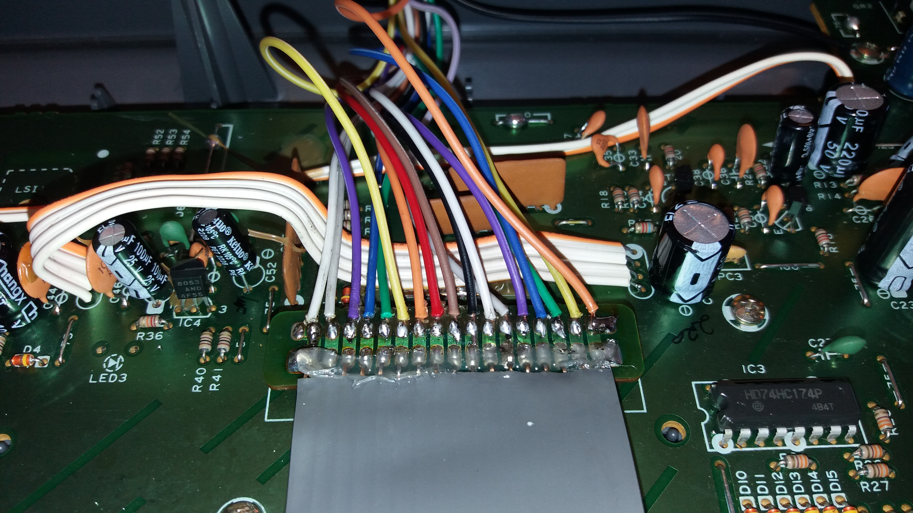
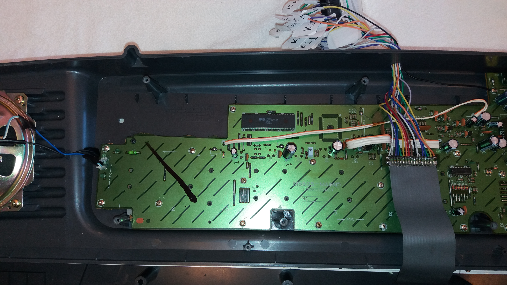
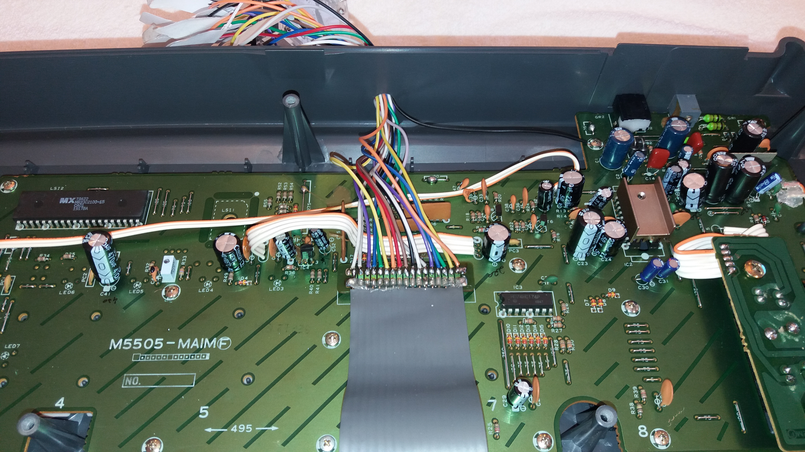
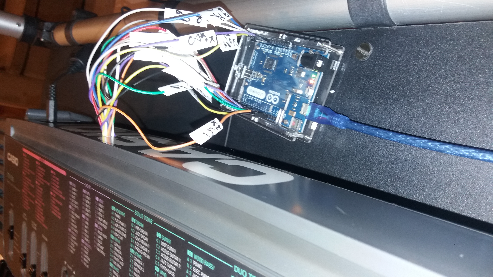

# Casio CTK-500 MIDI-fy

http://amatriz.net/posts/CTK-500-MIDI-fy.html

# Arduino Leonardo pin-out to CTK-500 Keyboard Flat Connector

First connect the wires according to this diagram

# First try with Female Jumper Cables and a soldered pin-header

Raphaela Elpidio from Circuit Bending Brazil restored the CTK-500 and soldered a pin header to connect Female Jumper Cables

# Final work with bare-wire Jumper Cables soldered to Keyboard Flat Connector

Later on I asked my friend Adriano Amaral from ADR Eletronics to solder the bare-wire jumper cables directly to the Keyboard Flat Connector due to persistent bad contact

# Soldered Jumper Cables overview with main PCB showing

Overhead view of the soldered probes and the Connector in relation to the main Keyboard PCB

# Closer look at the Soldered Connector with Jumper Cables exiting drilled hole

Raphaela Elpidio from Circuit Bending Brazil also drilled a hole to the back of the Keyboard Top-Cover allowing free flow of Jumper Cables

# Covered Keyboard with Jumper Cables entering the Arduino Leonardo

Ready for Playing

